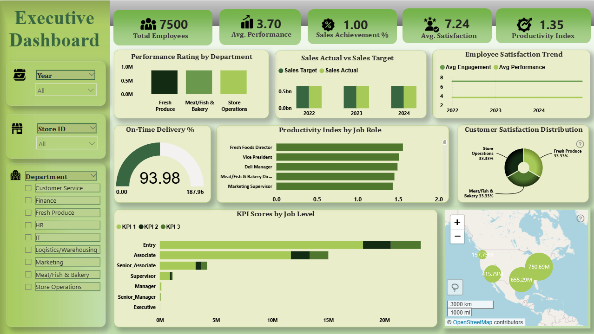
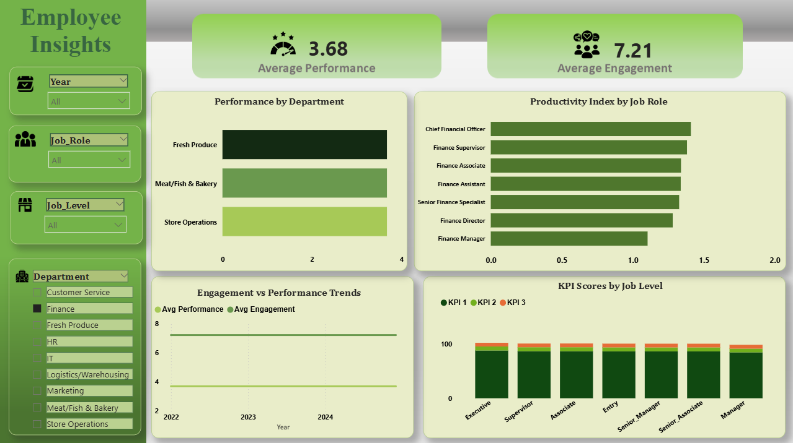
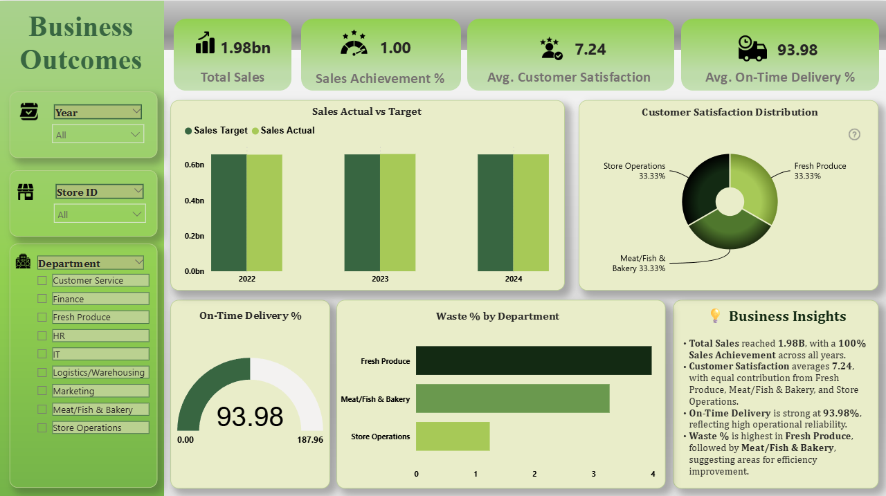

# 📊 Employee Performance Analysis – Power BI Dashboard  

## 🔹 Project Overview  
This project presents a comprehensive **Employee Performance Analysis Dashboard** built in **Power BI**.  
The dashboard analyzes a large HR dataset of **497,000+ employee records** to uncover actionable insights about **workforce performance, engagement, compensation, training, and business outcomes**.  

The report is fully **interactive with ZoomCharts drill-down visuals**, allowing dynamic exploration of employee and organizational trends.  

---

## 🔹 Dashboard Preview  

### 📌 Page 1: Overview Dashboard  
  

### 📌 Page 2 & 3: Employee Insights & Business Outcomes  
| Employee Insights | Business Outcomes |  
|-------------------|-------------------|  
|  |  |  

---

## 🔹 Dataset Details  
The dataset contains diverse HR and business data, including:  
- 👩‍💼 **Employee Information**: demographics, education, job roles, departments  
- ⭐ **Performance & Engagement**: ratings, satisfaction scores, absenteeism, overtime, training hours  
- 💰 **Compensation**: salaries, benefits, bonuses, performance-based pay  
- 📈 **Career Progression**: promotion eligibility, manager-employee relationships, tenure  
- 🏬 **Business Outcomes**: store performance, sales, customer satisfaction, waste %, on-time delivery  
- 📅 **Time Series Data**: monthly records from **2022–2024**  

---

## 🔹 Key Questions Answered  
The dashboard addresses several business-critical HR questions:  

1. How many employees left the company? Which department is most affected?  
2. What is the average salary by job level and department?  
3. Which months show peak performance ratings?  
4. Who are the top 10 managers by team performance?  
5. Do training hours correlate with better performance?  
6. Which 5 stores perform best in sales?  
7. Which departments have the highest satisfaction levels?  
8. Which job roles are most productive?  
9. Which employees are most likely to be promoted?  
10. How does employee age impact performance ratings?  

---

## 🔹 Dashboard Pages  

📌 **Page 1: Overview**  
- KPIs: Total Employees, Sales, Engagement & Performance Index  
- Sales vs Target Achievement  
- Department Performance Comparison  
- On-Time Delivery Trends  

📌 **Page 2: Employee Insights**  
- Average Performance & Engagement by Department  
- Performance by Job Role  
- Engagement vs Performance Correlation  
- KPI Scores by Job Level  
- Promotion Probability Analysis  

📌 **Page 3: Business Outcomes**  
- Sales (Actual vs Target) by Department  
- Customer Satisfaction Distribution  
- Waste % by Department  
- On-Time Delivery %  

---

## 🔹 Key Insights  
- ✅ Employee satisfaction averages **7.24**, with Finance showing relatively stronger engagement.  
- ✅ Performance ratings remain steady, with some job roles (e.g., Fresh Produce) leading in productivity.  
- ✅ Sales achievement is consistently close to **100%**, while on-time delivery stands at **93.98%**.  
- ✅ Training hours show a moderate positive correlation with performance improvement.  
- ✅ Highest employee exits are observed in specific departments, highlighting areas for HR intervention.  
- ✅ Waste % is highest in Fresh Produce, signaling scope for operational efficiency.  

---

## 🔹 Tools & Technologies Used  
- **Power BI** → Dashboard design & data modeling  
- **ZoomCharts Drill-Down Visuals** → Enhanced interactivity & drill-down analysis  
- **DAX (Data Analysis Expressions)** → Custom measures & calculated columns  
- **Excel / CSV** → Dataset storage & preprocessing  
- **GitHub** → Project version control & portfolio showcase  

---

## 🔹 Project Files in Repository  
- `Employee_Performance_Analysis.pbix` → Power BI dashboard file  
- `employee_performance_data.zip` → CSV files (dataset)  
- `README.md` → Project documentation (this file)  
- `screenshots/` → Dashboard preview images  

---

## 🔹 How to Use  
1. Clone or download this repository.  
2. Extract the dataset (`employee_performance_data.zip`).  
3. Open the `.pbix` file in **Power BI Desktop**.  
4. Explore the dashboard with slicers and drill-down filters for deeper insights.  

---

## 👩‍💻 Author  

**Sneha Ghosh**  
📍 MSc Economics | Data Analytics Enthusiast  
💼 Skilled in Power BI, SQL, Python, Excel, and Data Modeling  

🔗 Connect with me:  
- [LinkedIn](https://www.linkedin.com/in/sneha-ghosh/)   

---

✨ This project demonstrates how **HR data analytics** can empower decision-making by combining **employee performance trends** with **business outcomes** for a holistic view of organizational growth.  
